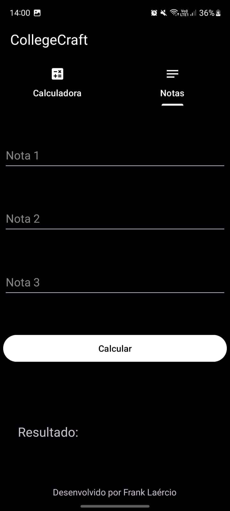

# CollegeCraft

This is a simple calculator that can perform basic arithmetic operations and a grade calculator that can calculate the average of grades.

## Usage

To use the calculator, simply enter the numbers and the operation you want to perform. The calculator will display the result.

### Supported Operations

- Addition (+)
- Subtraction (-)
- Multiplication (\*)
- Division (/)

### Examples

- `2 + 2 * 5 = 12`
- `10 - 5 = 5`
- `3 * 4 = 12`
- `2 + 20 / 4 = 7`

The calculator can be used in two ways:

1. To use a simple calculator
2. To use a grade calculator

## How to start the application

Note: This application is only available for Android devices and you need to have Java 8 or more installed on your computer.

1. Clone the repository
2. Open the project in Android Studio
3. Run the application
4. Enjoy!

## UI/UX

The user interface (UI) and user experience (UX) are designed using the following technologies:

- Material Design
- Android Based Layout

|  |   |
| :--------------------------------: | :----------------------------: |
|         _Light Calculator_         |         _Light Grade_          |
|                :--:                |              :--:              |
|      |  |
|         _Dark Calculator_          |          _Dark Grade_          |

## Author

This code is written by Frank Laércio.

## License

This project is licensed under the MIT License rules - see the LICENSE.md file for more details.
